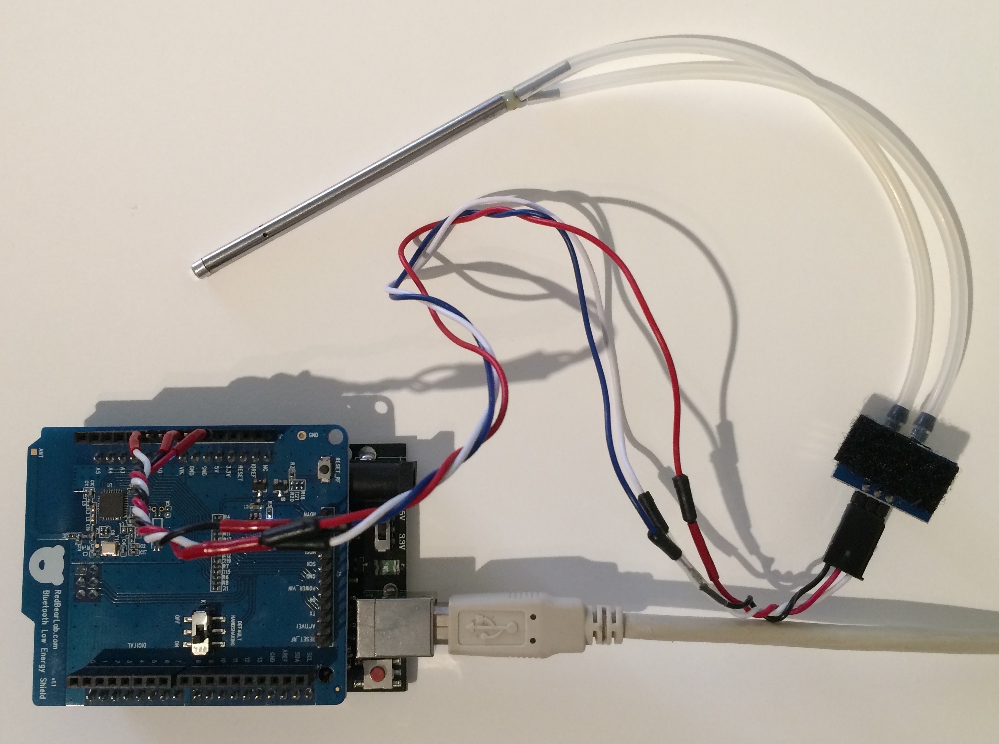
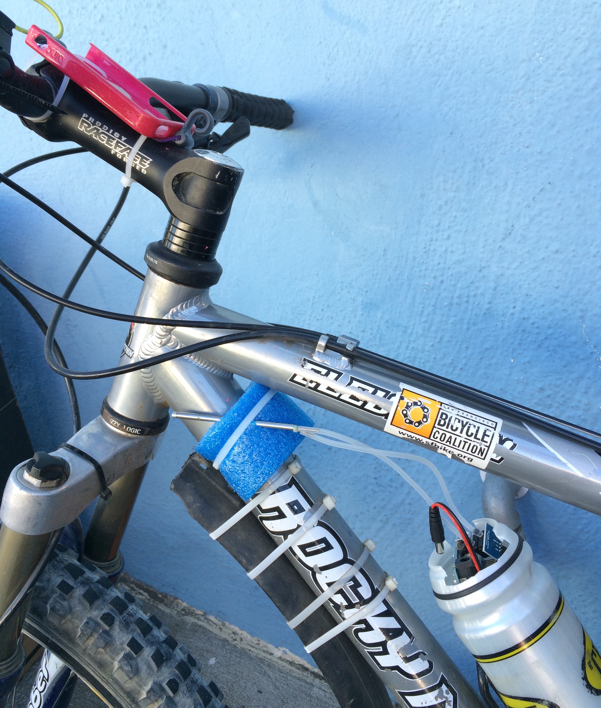
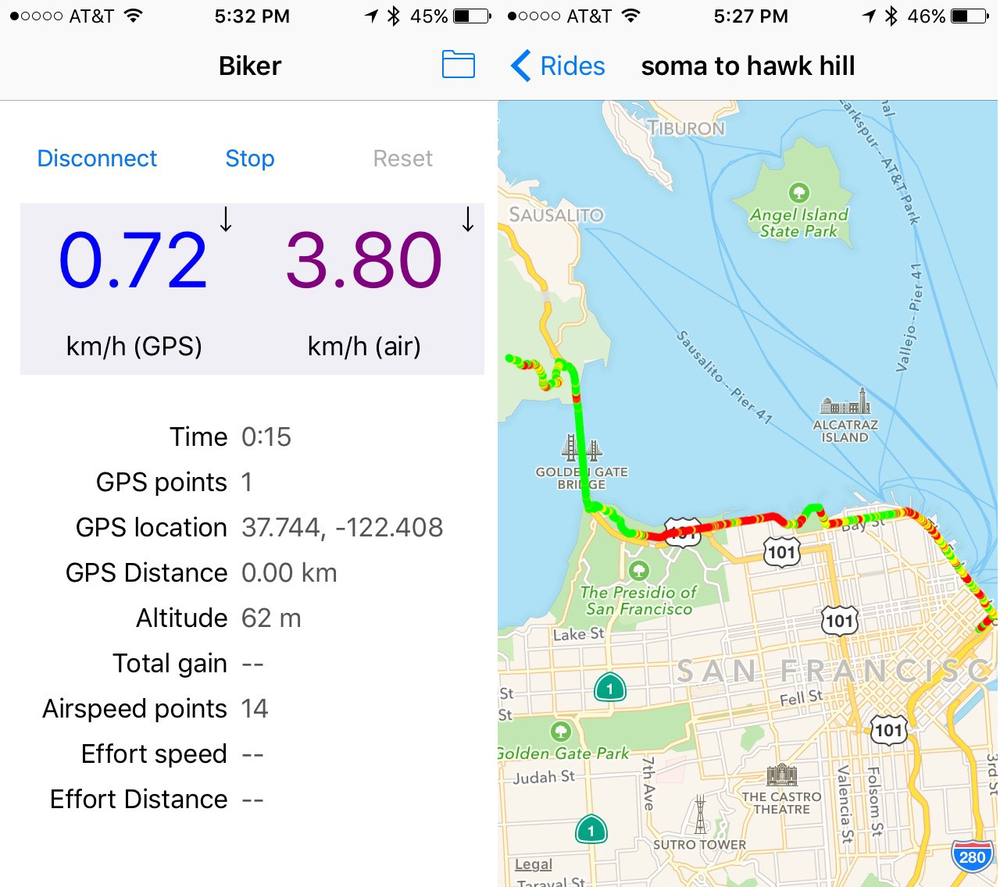

# README

AirBiker is an iOS app and a simple Ardunio sketch. The Arduino reads the real-time airspeed as measured by a compact [Pitot tube](https://en.wikipedia.org/wiki/Pitot_tube) + airspeed sensor connected to analog input 0, and reports it back to the iOS app using Bluetooth LE. When the pitot tube is carefully mounted on a bicycle (on or near the headtube) such that it's pointed directly forward and will receive an unimpeded air flow as the cyclist moves forward, the measured airspeed, when compared to the groundspeed as measured by the GPS of the iPhone, can be used as a proxy for wind resistance.

## Hardware required
* [Arduino Uno](http://arduino.cc/en/Main/arduinoBoardUno) (it will probably work with other variants, but I've only tested it with the Uno)
* RedBearLab's [BLE shield](http://redbearlab.com/bleshield/)
* Airspeed Pitot tube [kit](http://www.amazon.com/Airspeed-Kit-with-MPXV7002DP/dp/B009SNPQKY)
* Bluetooth LE-capable iOS device (iPhone 4S or later)

On the bench:

Mounted on my bike:

## Communications

Communications from the iOS app to the Arduino is facilitated by the simple Tx/Rx transport mechanism exposed by RedBearLab's BLE library. At this point, there is only a single request/response pair that is supported - the iOS app sends a single command byte (0x01), and the Arduino responds with 4 bytes - the estimated airspeed.

## Dependencies

Arduino libraries:

* [TimerOne_r11](https://code.google.com/p/arduino-timerone/downloads/list)
* RBL_BLEShield (modified version to allow configuration of the primary service and characteristic UUIDs)
* Nordic_BLE

## Usage

Here's two screenshots from the iOS app. The one on the left is the data (I'm going for a bike ride!) capture mode. The total gain, effort speed and effort distance values are not currently populated. 

The one on the right is the view of a captured ride. On this screen, three colors are used to estimate the wind resistance: high (red), medium (yellow) and low (green). The current simplistic calculation simply compares the measured airspeed to several constants (i.e. does not take the ground speed into account) - based on my observations of what seemed like "high", "medium" and "low" in-your-face headwinds while cycling on flat surfaces in San Francisco. This particular route was captured while riding (mostly) east-to-west from downtown SF, over the Golden Gate bridge and up Hawk Hill. The red part through the Marina district, which is relatively flat, accurately reflects a higher LOE due to the typical westerly winds that are present on that stretch.

The captured raw CSV data (in .biker files) can be extracted from the phone's filesystem using a tool such as [iExplorer](https://www.macroplant.com/iexplorer/) for further analysis. The fields are:
* time (in seconds since the start of the ride)
* latitude
* longitude
* horizontal accuracy (m)
* altitude (m)
* vertical accuracy
* GPS instantaneous speed (km/h)
* airspeed (km/h)
* GPS distance from the last reading (m)

## Building

If you build this thing, you might want to consider changing the primary service and characteristic UUIDs of the BLE shield using [Nordic's nRFgo Studio](https://www.nordicsemi.com/chi/node_176/2.4GHz-RF/nRFgo-Studio).

Alternatively, with a few simple tweaks to the Arduino sketch, you could use a [BLE Mini](http://redbearlab.com/blemini/) instead.